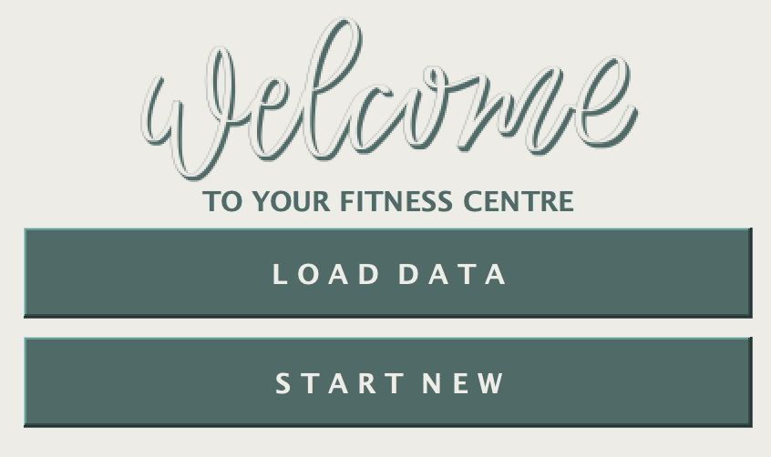
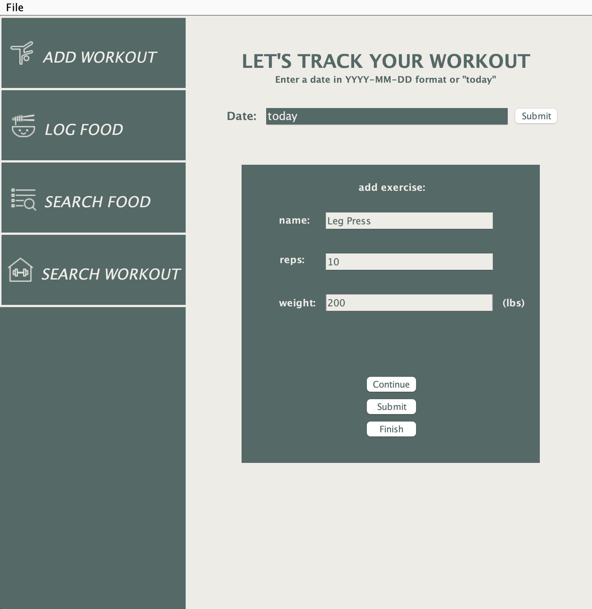
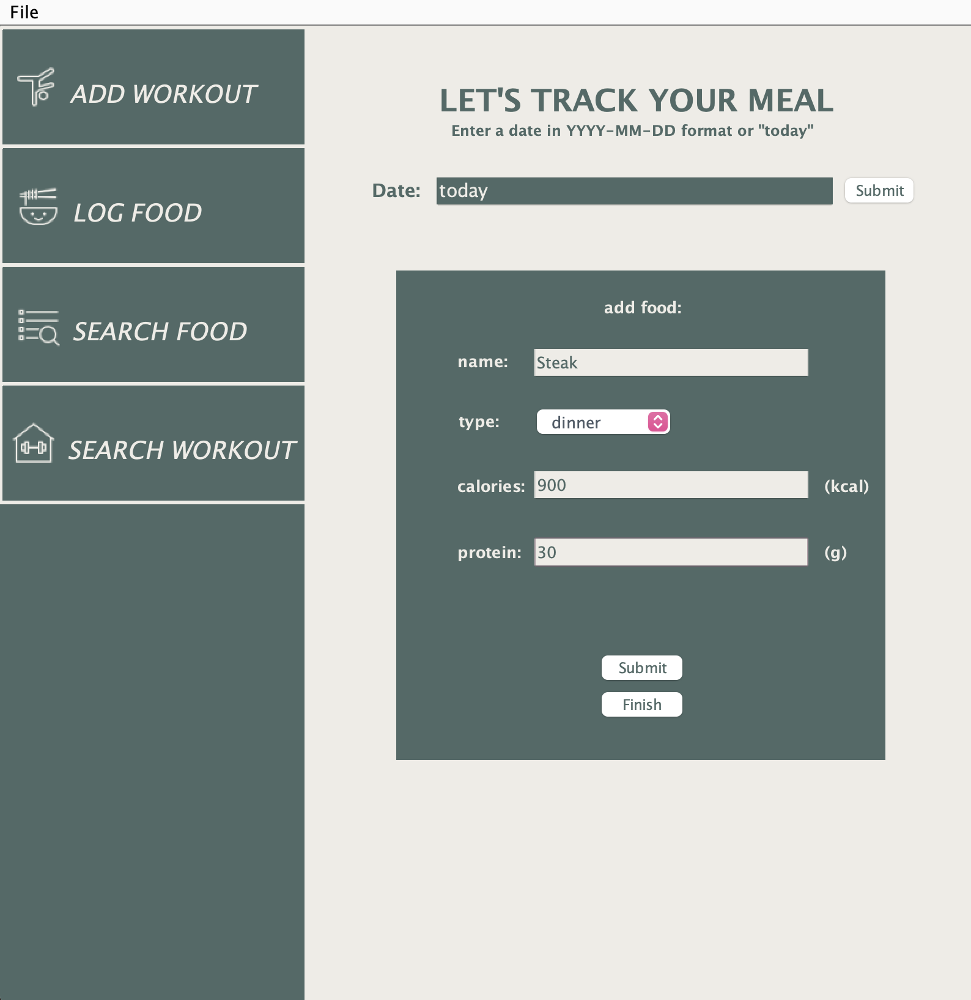
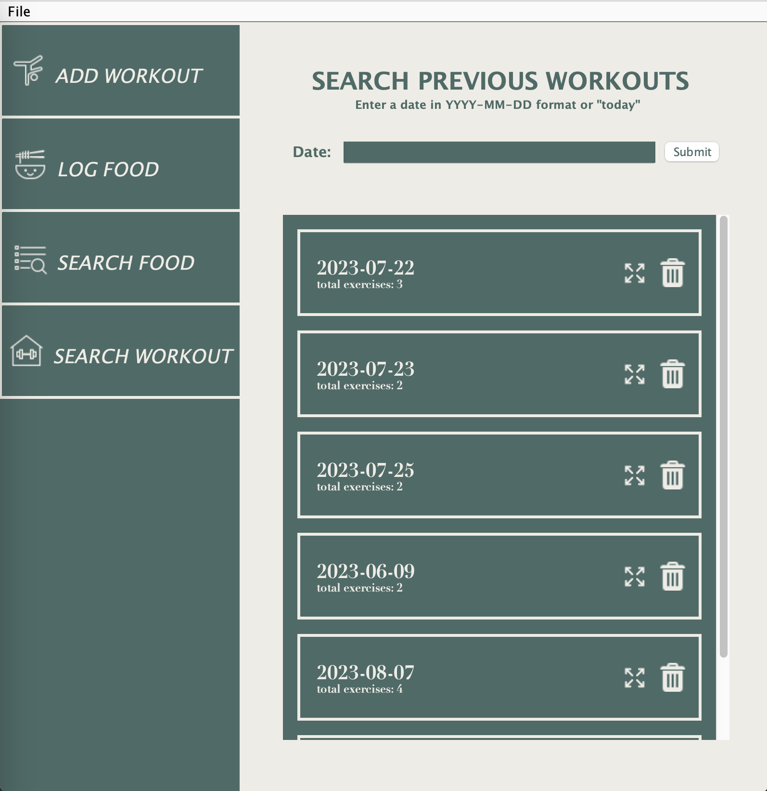

# Your Fitness Buddy

## Desktop Well-being Tracker

I developed a comprehensive desktop well-being tracker that empowers users to monitor 
and enhance their fitness journey. I implemented features that enable users to effortlessly track their workouts and
meals, fostering a holistic approach to personal health.

### Project Specifications Before Development

This application will provide users with a platform to aid 
their fitness journey. Features of this program will
include:
- recording **calorie intake**
- recording day to day **workout sets**

This platform will be useful to anyone who would like to better manage
their macronutrients and execute progressive overload at the gym. I am 
passionate about this project because I believe recording reps and sets
can be very beneficial in ensuring consistency while resistance training,
and I have yet to find a system that I enjoy using. Thus, I would like to
create one!

### User Interface 

| Workout Tracker UI | Meal Tracker UI | View History   |
|--------------------|-----------------|----------------|
|    |    |  |
